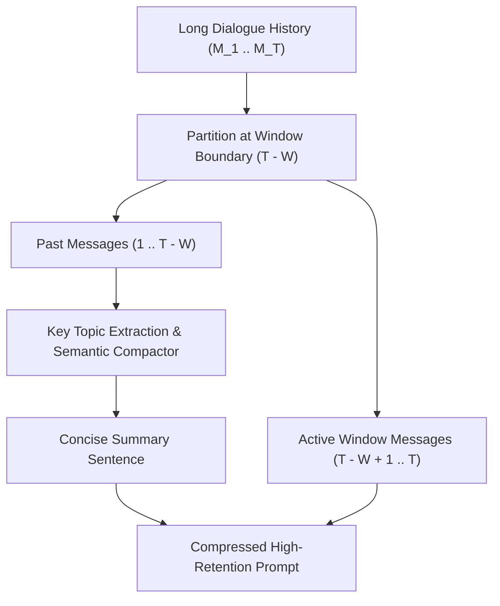

# genpark-conversation-summarizer-sliding-window-skill

Agent Skill implementing **Conversation History Summarization & Sliding Window Compression** in 100% Python standard library.

## Architectural Flow

